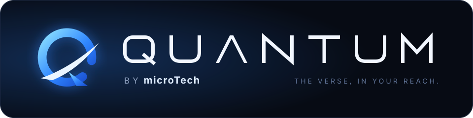
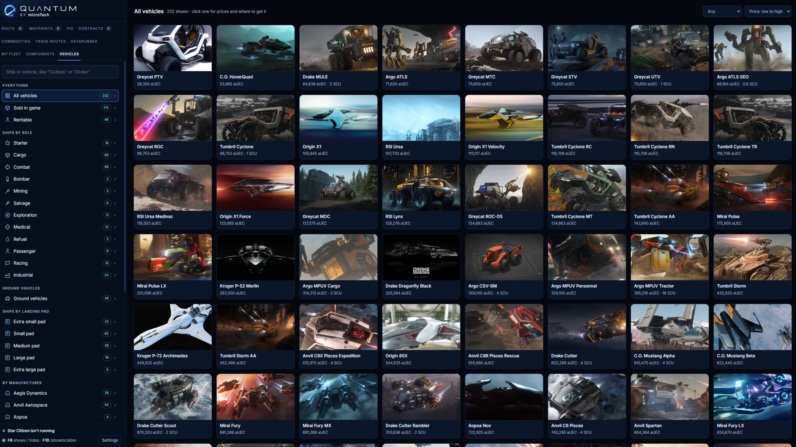
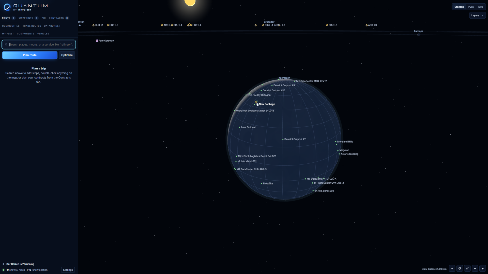
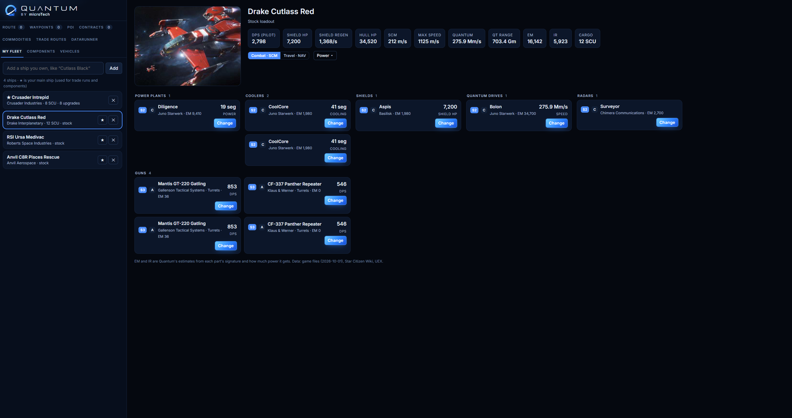
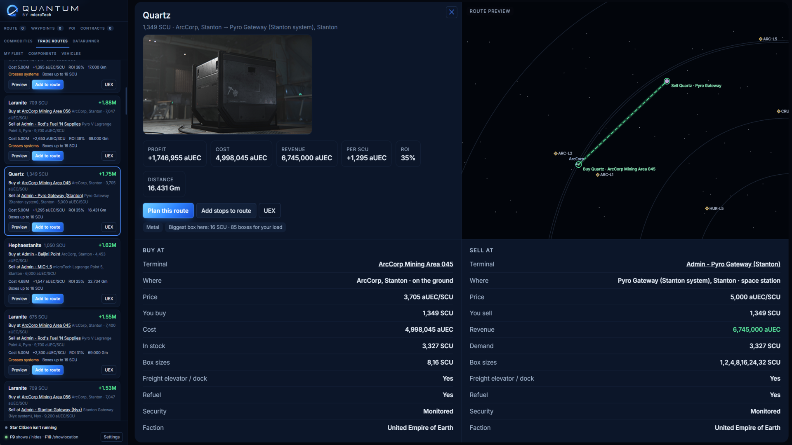

  

# Quantum - A 3D navigation map, route planner, contract tracker, trade companion and datarunner tool for Star Citizen.

---

  

  <picture>
    
  </picture>

<table>
  <tr>
    <td>
      <picture>
        
      </picture>
    </td>
    <td>
      <picture>
        
      </picture>
    </td>
    <td>
      <picture>
        
      </picture>
    </td>
  </tr>
</table>

Quantum runs next to Star Citizen on Windows. It reads your `/showlocation` coordinates and the game's own log to show where you are on a live 3D map of the system, plans and guides multi-stop routes, and tracks your hauling contracts from pickup to delivery. With a free UEX token it also finds profitable trade routes, compares ships and fits components. With a UEX datarunner account you can report terminal prices from inside Quantum, climb the ranks and keep trade data fresh for everyone.

> **Fan project.** Quantum is an unofficial Star Citizen fan tool. It isn't affiliated with or endorsed by Cloud Imperium Games. It never changes game files or memory: it only reads `Game.log` and your clipboard, and (if you ask it to) types `/showlocation` into chat and takes screenshots of the game window for price reports.

## Contents

- [Features](#features)
- [Getting started](#getting-started)
- [Connecting UEX (trade data)](#connecting-uex-trade-data)
- [Datarunner: reporting prices](#datarunner-reporting-prices)
- [Using Quantum in game](#using-quantum-in-game)
- [The tabs](#the-tabs)
- [The Quantum community](#the-quantum-community)
- [Updates](#updates)
- [Keeping the data up to date](#keeping-the-data-up-to-date)
- [Your data and privacy](#your-data-and-privacy)
- [Credits](#credits)

## Features

**Map and navigation**
- Interactive 3D map of Stanton, Pyro and Nyx: planets, moons, stations, cities, outposts, Lagrange points and gateways.
- Your position from `/showlocation`, and from the game log between readings (landed at, talking to traffic control, just took off from).
- Plan routes with as many stops as you like, optimise their order, and follow a live guide to the next stop.
- An in-game overlay you toggle with a hotkey, and a hotkey that types `/showlocation` for you.
- Places no dataset has a position for (Pyro and Nyx gateways, Wikelo emporiums, UEX-only stations) are listed under **Not on the map yet**. One `/showlocation` there puts them on your map, and once they're confirmed they appear on every Quantum user's map within about 10 minutes, without a restart.

**Contracts**
- Hauling contracts are picked up from `Game.log` automatically, with their pickups and drop-offs pinned on the map.
- A tracker for each contract (*Accepted › Collected › Out for delivery › Delivered*) with a parcel-style tracking number.
- Mark cargo as picked up yourself when the game doesn't report it.

**Trade and ships** (with a free [UEX](https://uexcorp.space) token)
- **Commodities:** where each commodity is cheapest to buy and sells best, with stock, prices and a map view.
- **Trade Routes:** ranked routes from a planet, or from one place on it like Baijini Point, for your ship's cargo and your budget, with a full route page and preview. Type any ship with cargo space (your fleet's ships are listed first). Plan a route and track it *Planned › Bought › In transit › Sold*, including auto loading and unloading fees. Share a planned route and other Quantum users see it in *Find Routes* for a week.
- **Vehicles:** every ship and ground vehicle with specs, and where to buy or rent it (including the Drake Command Module, which comes with the Caterpillar and Ironclad).
- **Components:** a landing page of every component category (systems, avionics, weapons, mining). Each category has search and filters for size, grade, maker, where to get it (shops, or loot, crafting and ship stock) and what fits your ships, plus sorting by price or by the stat that matters (DPS, shield HP, quantum speed, cooling). A component's page shows its game-file stats, where to buy it, whether it fits your main ship, and **Fit here** buttons for every matching slot in your fleet.
- **My Fleet:** your ships with their stock loadouts. Swap components, see the stats change, and get an EM/IR estimate with Combat (SCM) and Travel (NAV) modes.

**Datarunner** (with a UEX datarunner account)
- Report a terminal's prices to UEX from Quantum: the terminal is picked from the game log, every row starts from UEX's current numbers, and most rows need one key press.
- **Jobs:** terminals with the most out-of-date prices, stations that still need mapping, planets and moons to line up for the current game version, and things with no picture yet. *All jobs* shows every kind; a tab with no jobs hides itself until there are some. *Accept job* holds one for you for 30 minutes and shows other datarunners it's in progress; *I've arrived* opens the terminal in Report Prices, and sending the report finishes the job. *Start job* on a station walks you through it: go there, press *I've arrived*, `/showlocation`, submit, and see whether it's live or waiting for a second datarunner. If a place UEX lists isn't in the game, *Doesn't exist* hides it; once a second datarunner agrees, it's hidden for everyone. *Accept job* on a picture job shows exactly what's needed and checks your screenshot before you send it.
- **My Reports:** what UEX did with each item you reported, grouped by terminal visit, with your star rating and rank. Click an item's status to open its report on UEX, and 📷 to see the screenshot it was sent with (kept on your PC for 14 days). Rejected items show the reason when UEX or the reviewer gives one.
- **Top 10:** the best Quantum datarunners, with a title card for #1.
- **FAQ:** how ratings, ranks and jobs work.
- Approved reports show up for every Quantum user within seconds, rather than waiting for UEX to merge them.

## Getting started

### Requirements

- Windows 10 or 11

## Connecting UEX (trade data)

The **Commodities**, **Trade Routes**, **Datarunner**, **Vehicles**, **Components** and **My Fleet** tabs use live, community-reported data from the [UEX API](https://uexcorp.space/api/documentation/). Access is free but needs your own token. These tabs stay hidden until you add one.

1. Sign in at [uexcorp.space](https://uexcorp.space) and go to **[My Apps](https://uexcorp.space/api/apps)**.
2. Create an app (any name, e.g. "Quantum") and copy its **access token**.
3. In Quantum, click **Settings** (bottom left) and find **Trade data (UEX)**.
4. Paste it into **UEX Bearer Token** and press **Save**. Quantum checks it with UEX first and only keeps it if it works.

Things to know:
- The token is stored only in your local `settings.json`.
- UEX allows 120 requests a minute. Quantum caches its data (places for a day, prices and routes for 30 minutes) and should stay well under the limit.
- UEX prices are reported by players. They can be out of date, so check the terminal before you buy.

## Datarunner: reporting prices

Reports go to UEX under your own account, so you need a UEX account with datarunner access turned on in your [UEX profile](https://uexcorp.space/account).

1. In **Settings → Trade data (UEX)**, paste your **UEX Secret Key** (from your UEX profile) and press **Save**. It's used to send your reports and to sign in to the Quantum community server (see [Your data and privacy](#your-data-and-privacy)), and stays on your PC.
2. Go to a commodity kiosk. Land or dock and Quantum picks the terminal from the game log, or type it in the **Terminal** box.
3. Open the kiosk's list in game and take a screenshot (UEX needs one during a new datarunner's first 90 days; after that, Quantum offers to send without one, and UEX's answer settles it): press your screenshot key (set it in **Settings**) or **Take screenshot** in Quantum. UEX checks every report against it, so data entry stays locked until there is one. For a long list, scroll and take another; they're joined into one picture.
4. Check each row. Matches the kiosk: **No Changes** (or Space). Different: type the stock and price and set the inventory bar. Gone from the kiosk: **Not Sold Here**. Keys: ↑ ↓ move, Space no changes, Enter edit, 1–7 inventory, G not sold here.
5. **Submit Report**, then follow it in **My Reports**.

Take screenshot only works while Star Citizen is running and a terminal is picked, and the Note box unlocks once a terminal is picked.

**Ratings and ranks**
- Every decided price row, picture and station position counts: approved is 5 stars, rejected is 1 star, and your rating is the average. Your first approved report sets you to 5.0.
- Ranks go by approved reports: Trainee (1), Runner (50), Field Analyst (250), Trade Analyst (750), Quantum Analyst (2000). Each approved price row, picture, station position and planet alignment counts as one.
- Rows still waiting for review, expired rows and test reports don't count. The **FAQ** view in the Datarunner tab has the details.

**Keep your reports approved:** only report what the kiosk shows right now, double-check prices more than 25% from UEX's average (they're held for manual review), and remember the same item at the same terminal can be reported once every 5 minutes. Repeated wrong reports can get your UEX datarunner access suspended.

## Using Quantum in game

| Key | What it does |
|---|---|
| **F9** | Show or hide Quantum over the game |
| **F10** | Types `/showlocation` in game chat, so the map knows exactly where you are |
| **Screenshot key** | Screenshots the kiosk for a datarunner report (unset until you pick one, e.g. F12) |

You can change all of them in **Settings**. The `/showlocation` key starts unset on a fresh install; pick one in Settings (F10 works well).

- **Game.log** is found automatically while Star Citizen is running. Quantum reads it for contracts, approximate positions, the terminal you're at and the game version.
- **Admin rights:** if Star Citizen (or the RSI Launcher) runs as administrator, Quantum must too, or Windows won't let its hotkeys type into the game. Settings has a **Restart Quantum as administrator** button.
- **When the game is closed**, Quantum shows "Star Citizen isn't running" and hides your old position.

## The tabs

| Tab | What it's for |
|---|---|
| **Route** | Search places, moons or services ("refinery", "refuel"); build, optimise and follow a route |
| **Waypoints** | Places you've saved yourself |
| **POI** | Browse every place on the map |
| **Contracts** | Your hauling contracts from the game log, with trackers and map pins |
| **Commodities** | Buy and sell prices for any commodity, as a picture grid with a detail page and map view |
| **Trade Routes** | *Find Routes* ranks profitable runs from a planet or one place on it, including ones other users shared. *Planned Routes* tracks the ones you're doing, or ones you enter yourself |
| **Datarunner** | *Report Prices*, *Jobs*, *My Reports*, *Top 10* and *FAQ* |
| **My Fleet** | Your ships, their loadouts, component swaps, and EM/IR with power settings |
| **Components** | Every component category, with filters, game-file stats, shops and fitting to your fleet |
| **Vehicles** | Ships and vehicles with specs, where to buy and where to rent |

## The Quantum community

Quantum users share a few things through the Quantum community server (`quantumsc.ddnsgeek.com`):

- **Prices:** reports sent through Quantum are checked against UEX's own record and then shown to every Quantum user within seconds, marked ⚡. A report is shown for up to 72 hours, or until UEX's own data is newer, and is dropped as soon as UEX rejects it.
- **Station positions:** a station goes live on everyone's map once two datarunners' `/showlocation` readings agree. Quantum fetches new ones every 10 minutes.
- **Pictures:** anything with no picture (a commodity, component or vehicle) has a **Send a picture** button, and each one is a job under *Datarunner → Jobs → Pictures*. A picture must be a clear in-game screenshot of just that item, 16:9 and at least 1920 × 1080; Quantum checks this and shows you the screenshot before it's sent. Pictures are reviewed before they appear for everyone; **My Reports** shows each one as *Submitted*, *In Review*, *Approved*, *Live on Quantum* or *Rejected*, with the reason if it's rejected. Approved pictures appear within a couple of minutes, without a restart.
- **Planet alignments:** after a game update, landing at a known place and typing `/showlocation` lines that planet or moon up for the new version. It goes live for everyone once a second datarunner's alignment agrees.
- **Landing pad sizes:** pick a place's largest pad on its card. It's yours straight away and shows for everyone once a second datarunner agrees.
- **Shared trade routes:** routes you share from *Planned Routes* appear in other users' *Find Routes* for a week.
- **Encrypted backups:** your fleet and component swaps, waypoints, planned trade routes and mapped stations are backed up within a minute of any change. They're encrypted on your PC with a key made from your UEX Bearer Token (datarunner or not), so the server can't read them. On a new install, enter the same Bearer Token and they come back automatically. Restoring only adds what's missing; it never removes or overwrites anything. **Settings → Backup** shows when the last backup happened, and lets you delete your backup and turn backups off.
- **Datarunner profiles and the Top 10:** your rank, star rating and report counts, kept under your UEX username so they survive reinstalling Quantum.

Nobody can add to or take from someone else's profile: a report only counts once UEX's own record shows that username sent it.

**Trusted contributors.** Datarunners earn trust automatically once they have 5 approved price reports, 7 days since their first, no rejections in the last 14 days and at least 90% approval. A trusted contributor's pictures go live straight away (for things with no picture yet, up to 10 a day), and the stations they map and planets they line up go live from their reading alone. The Datarunner tab's FAQ shows your progress. Quantum signs in to the community server with your UEX secret key (the server asks UEX whose key it is, then forgets it), so any PC with your key in Settings is recognised, including a new PC or a reinstall.

## Updates

Quantum checks GitHub Releases at start-up and when you press **Check for updates** in Settings. Settings shows the version you're running.

- **The Windows build** downloads the new `Quantum.exe`, checks its signature, and installs it after a restart. It only installs releases signed with Quantum's release key.

Settings, fleet, reports and places live in files next to Quantum and aren't touched by updates. [CHANGELOG.md](CHANGELOG.md) lists what's new in each version.

## Keeping the data up to date

Positions come from community datasets, and component stats come from the game files.

- **Gateways and other places without positions:** dock there, press F10, then click **I'm here: set position** on the place's card (or **I'm here: map it** in Datarunner → Jobs). Positions are saved to `places.json`, which is safe to share, and sent to the community server so other users get them too.

## Your data and privacy

Your **UEX Bearer Token** and **UEX Secret Key** stay on your PC in `settings.json`. The token is only ever sent to UEX. The secret key is sent to UEX, and once to the community server when Quantum signs in to it: the server passes it to UEX to learn which UEX account it belongs to, then forgets it. It's never stored or logged there. In return the server gives Quantum a **session token**, kept in `settings.json`, so it knows the pictures, places and alignments you send are really from you.

Quantum talks to these services:

| Service | Why |
|---|---|
| **UEX API** | Prices, terminals, vehicles and items, and the price reports you send |
| **Quantum API** | Community prices, station positions, pictures, shared routes, datarunner profiles and the Top 10 |
| **Star Citizen Wiki API** | Ship data, loadouts and pictures |
| **GitHub** | Checking for updates |

What the community server receives from you:
- **Datarunner reports:** the UEX report IDs and values of reports you send, under your UEX username.
- **Contributions:** station positions, landing pad sizes and planet alignments you set, and pictures you send.
- **Shared routes:** routes you choose to share.
- **Your UEX profile:** your username and avatar link, for your profile and the Top 10. Your username and stats are visible to other Quantum users on the Top 10.
- **Your sign-in:** your UEX secret key once, over HTTPS, to confirm your UEX username with UEX (not kept). The session token it gives Quantum is stored on the server only as a one-way hash, with when and from where it was last used. Removing or changing your secret key in Settings signs that PC out.
- **Your backup:** encrypted on your PC before it's sent. The server stores it but can't read it, and your UEX Bearer Token is never sent to it. Only plain data from known fields is included, never files. If you make a new UEX token, the old backup can't be opened, and Quantum starts a new one locked to the new token.

It never receives your UEX Bearer Token, never keeps your secret key, and never receives your report screenshots (those go to UEX with the report, and Quantum's own copy stays on your PC).

The community server is looked after by its owner and a small team of moderators, who review contributions and can suspend or ban accounts that misuse it. To have everything the community server holds about you deleted, ask through Quantum's [GitHub page](https://github.com/Sammmy1036/Quantum). Your encrypted backup isn't tied to your name, so delete it yourself from **Settings → Backup**; UEX keeps its own copy of the reports you sent it. To turn the community features off, set `"community_url": "off"` in `settings.json`; Quantum then uses UEX's data alone.

| File | Holds |
|---|---|
| `settings.json` | Your UEX token and secret key, Quantum server sign-in, hotkeys, route, fleet and planned trade routes |
| `places.json` | Station positions you set with `/showlocation` |
| `community_places.json` | Station positions from other Quantum users |
| `datarunner_reports.json` | The reports you've sent and what UEX did with them |
| `report_screenshots/` | The screenshot each report was sent with, deleted after 14 days |
| `datarunner_test/` | Test-mode reports, saved instead of sent |
| `uex_cache/` | Cached UEX and wiki data, and datarunner avatars |

## Credits

Quantum stands on the work of the Star Citizen community:

- **[UEX Corp](https://uexcorp.space)**: commodity prices, trade routes, vehicles, items and the datarunner program.
- **[Star Citizen Wiki](https://starcitizen.tools)** and its **[API](https://api.star-citizen.wiki)**: ship data, loadouts and pictures.
- **[Valalol / Star-Citizen-Navigation](https://github.com/Valalol/Star-Citizen-Navigation)**: verified Stanton positions.
- **[starnav](https://crates.io/crates/starnav)**: Stanton, Pyro and Nyx points of interest.
- **[unp4k](https://github.com/dolkensp/unp4k)**: game-file extraction for component stats.
- **Quantum datarunners**: the prices, station positions and pictures they share.

Star Citizen®, Roberts Space Industries® and Cloud Imperium® are registered trademarks of Cloud Imperium Rights LLC. microTech is a fictional in-game company; its name is used here in the spirit of the game.
