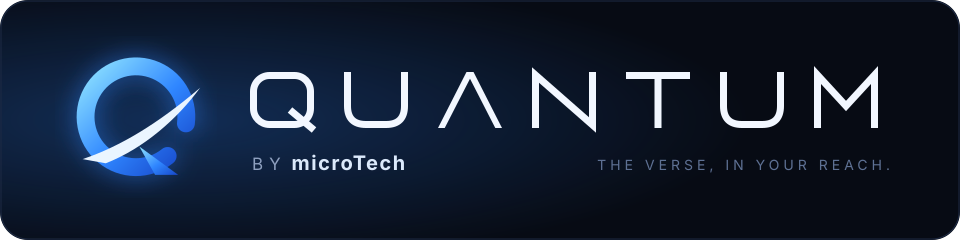

  

# Quantum

**A free Star Citizen companion for Windows:** a live 3D map and route planner, contract tracker, trade and fleet tools, a player marketplace, org tools and friends, all in one app.

  <a href="https://quantumsc.org/media/Quantum-Demo.mp4">▶ Watch the demo</a> 
  <video src="https://github.com/user-attachments/assets/11a8c488-6eb3-40d1-8b66-301771122156" width="1000" controls muted></video>

> **Fan project.** Quantum is unofficial and not affiliated with or endorsed by Cloud Imperium Games. It never changes game files or memory. It reads `Game.log` and your clipboard and, only when you ask, types `/showlocation` into chat and screenshots the game window for price reports.

> **Early development.** Quantum is updated often and some features are still rough. Found a bug or have an idea? Use **Settings → Send a report**.

## Download

Get `Quantum.exe` from [Releases](https://github.com/Sammmy1036/Quantum/releases/latest). Windows 10 or 11. Quantum updates itself and only installs releases signed with its release key.

## What it does

| | |
|---|---|
| **Navigate** | 3D map of Stanton, Pyro and Nyx with 3D cities and stations. Shows where you are from `/showlocation` and the game log, plans multi-stop routes across systems, and guides you to each stop. |
| **Contracts** | Hauling contracts are picked up from the game log and pinned on the map, pickups listed first, with a tracker for each one. |
| **Location Clock Overlay** | When you land or spawn in a city, the overlay shows its name and local time over the game. Choose how long it stays, where it sits and how big it is in Settings. |
| **Trade** | Commodity prices, where mined resources are found, and ranked trade routes for your ship and budget. |
| **Ships** | Every vehicle and component with stats and where to buy them. My Fleet keeps your ships with up to 5 loadouts each. |
| **Gear** | Weapons, armor, clothing, gadgets, keys, consumables and blueprints, and your own gear loadouts for each kind of job. |
| **Cart** | Put anything you want to buy in one cart, and Quantum plans the fewest stops to buy it all. |
| **Datarunner** | Report terminal prices to UEX from inside Quantum, take jobs, and climb the ranks. |
| **Social** | Friends, messages and online status. |
| **Market** | Buy and sell items and services with other players, **aUEC only**. Optional escrow for trades of 1,000,000 aUEC or more. |
| **Org** | Your org's members, ranks with icons, calendar, events with crew seats, and invites. Orgs verified with RSI are listed in Find orgs. |
| **Profile** | Your fleet, loadouts, orgs, listings and datarunner stats, with control over what others see. |

## Getting set up

1. **Create a free Quantum account** at [quantumsc.org](https://quantumsc.org/account/signup) and confirm your email. You choose your **username** at sign-up. It's your one name everywhere in Quantum and it's permanent. Then sign in from the app by clicking the picture at the top of the left bar.
2. **Add your UEX keys** (optional, but needed for Trade, Ships, backups and datarunning): in [UEX](https://uexcorp.space/api/apps), create an app and copy its **Bearer Token**. Paste it under **Profile → Linked accounts**. To report prices, also add your **UEX Secret Key** from your UEX profile.

The map, routes, contracts, gear, blueprints and the clock work without any account.

## In game

| Key | What it does |
|---|---|
| **F9** | Show or hide Quantum over the game |
| **F10** | Types `/showlocation` so the map knows exactly where you are |
| **Screenshot key** | Screenshots a kiosk for a price report (set it in Settings) |

All keys can be changed in **Settings**. If Star Citizen runs as administrator, Quantum must too (Settings has a button for it). Overlays need Borderless or Windowed mode.

## Social, Market and Orgs

These need a Quantum account.

- **Profiles:** click anyone's name in Social, the Market or an org to see their profile. Choose who can see yours (everyone, friends or only you) and what it shows under **Profile → Profile privacy**.
- **Market:** listings are **aUEC only**. Real-money trades break Star Citizen's Terms of Service and get listings taken down. Quantum doesn't take part in trades. Escrow agents are volunteer players, and the escrow fee goes to them. Report a listing with the ⚑ button.
- **Orgs:** anyone can create an org. To be listed in Find orgs, an org must be **verified with RSI**: use your RSI org's SID as the tag, put the code Quantum gives you on your RSI org page, then press **Check now**. You can set an org to Private in its Settings.

## Backups

With a UEX Bearer Token, Quantum backs up your fleet, loadouts, waypoints, trade routes and mapped stations automatically. The backup is locked with your token on your PC, so nobody else can read it, not even the server. On a new PC, enter the same token and everything comes back.

## Privacy

Quantum keeps your keys and data on your PC unless you choose otherwise, and the server keeps only what's needed for the features you use. The full details are in the [privacy policy](https://quantumsc.org/privacy). You can download or delete everything your account holds from [your account page](https://quantumsc.org/account?tab=security). To run Quantum without any community features, use **Settings → Disable community features**.

## Credits

- **[UEX Corp](https://uexcorp.space):** prices, trade data, vehicles, items and the datarunner program
- **[Star Citizen Wiki](https://starcitizen.tools)** and its **[API](https://api.star-citizen.wiki):** ships, gear, blueprints, missions and pictures
- **[Valalol / Star-Citizen-Navigation](https://github.com/Valalol/Star-Citizen-Navigation)** and **[starnav](https://crates.io/crates/starnav):** navigation data
- **[unp4k](https://github.com/dolkensp/unp4k):** game-file extraction for component stats
- **Quantum datarunners:** the prices, station positions and pictures they share

Quantum's code is under the [MIT License](LICENSE.txt), which also lists third-party code and data. [CHANGELOG.md](CHANGELOG.md) lists what's new in each version.

Star Citizen®, Roberts Space Industries® and Cloud Imperium® are registered trademarks of Cloud Imperium Rights LLC. microTech is a fictional in-game company; its name is used in the spirit of the game.
